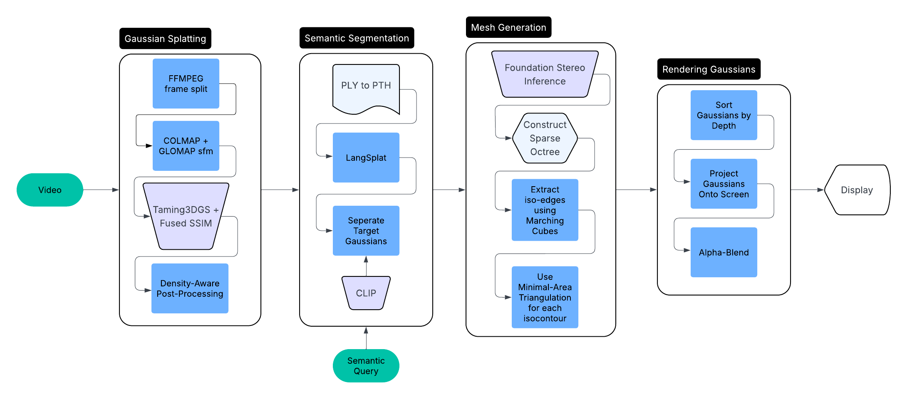

# MeshAnyGaussians
## Authors

  

    <h3>Siyuan Xie</h3>
    
UC Berkeley

  

  

    <h3>Alper Gel</h3>
    
UC Berkeley

  

  

    <h3>Ryan Arlett</h3>
    
UC Berkeley

  

  

    <h3>Sihan Ren</h3>
    
UC Berkeley

  

## Abstract

3D Gaussian Splatting (3DGS) is a classical method for accurate scene reconstruction. Since Gaussian splats serve as an implicit geometric primitive, prior works have attempted to convert them into explicit mesh representations to enable compatibility with modern industrial pipelines, such as SuGaR, GS2Mesh, and others. However, existing approaches often suffer from poor surface quality and undesirable object adhesion, which significantly limits their practicality in real-world applications.

To address these issues, we propose a pipeline with an adaptive mesh extraction process guided by local point density, coupled with a semantic-aware segmenting strategy. Specifically, we leverage a post-training process to augment an existing Gaussian scene with semantic information, resulting in a semantically enriched point cloud. Based on a text query, we render consistent multi-view depth maps and semantic masks. We then apply TSDF fusion in conjunction with an Iso-Octree structure to adaptively extract high-quality meshes from the masked depth regions.

In summary, our system enables high-quality mesh extraction of arbitrary objects specified by text input, given a video of a scene. Additionally, we implement a custom renderer that seamlessly supports both Gaussian splatting and the extracted mesh representation.

> Teaser

## Method:

> Pipeline Image

We decompose the overall pipeline into four subtasks: (1) 3DGS-based scene reconstruction, (2) semantic information extraction from the optimized Gaussian points, (3) depth estimation guided by text input, and (4) mesh extraction from masked depth maps using TSDF and iso-octree fusion.

### Gaussian Splatting for Accurate Reconstruction

We begin by converting the input video into a dense Gaussian Splatting (GS) representation. To achieve this, we first sample the video at 2 fps, and only select the sharpest frames using a variety of OpenCV functions. Next, we run *SIFT-GPU* + *COLMAP* feature extraction followed by *COLMAP* matching [7][13]. Finally, to optimize for speed, we utilize *GLOMAP*'s mapper to complete the SFM process [8]. 

During training, we utilize the *Taming-3DGS* + Fused SSIM accelerated rasterization engine to achieve sub 20-minute training times on consumer GPU's (RTX 4070 mobile) [12].

### Semantical Segmentation

We model semantic segmentation on the Gaussian point cloud to introduce cross-point semantic awareness. To this end, we adopt the LangSplat framework to semantically enhance each 3D point by assigning it a language-relevant feature vector [5]. Specifically, LangSplat uses the CLIP image encoder to extract language-aligned feature vectors (of dimension $D=512$) from semantic regions across training views [11]. These features are then compressed into a lower-dimensional space $\mathbb{R}^d$ using a lightweight scene-adaptive autoencoder. The final $d$-dimensional embeddings ($d=3$) are used to supervise the semantic attributes of each Gaussian point.

For each semantic level $l \in \{\text{subpart}, \text{part}, \text{whole}\}$, LangSplat defines an encoder $E$ and decoder $\Psi$ to project CLIP features $L_t^l(v) \in \mathbb{R}^D$ into latent space representations $H_t^l(v) = E(L_t^l(v)) \in \mathbb{R}^d$, and minimizes the reconstruction error through an autoencoding loss:

$$
\mathcal{L}_{\text{ae}} = \sum_{t=1}^T \sum_{l \in \{s, p, w\}} \text{dist}\left( \Psi(E(L_t^l(v))),\; L_t^l(v) \right)
$$

Each 3D Gaussian point $i$ is assigned a learnable embedding $f_i^l \in \mathbb{R}^d$ corresponding to its language feature at level $l$. These features are rendered into each training view using a tile-based Gaussian Splatting renderer, producing a per-pixel semantic projection:

$$
F_t^l(v) = \sum_{i \in \mathcal{N}(v)} f_i^l \cdot \alpha_i \cdot \prod_{j=1}^{i-1}(1 - \alpha_j)
$$

where $\alpha_i$ denotes the opacity contribution of the $i$-th Gaussian to pixel $v$, and $\mathcal{N}(v)$ is the set of Gaussians covering $v$.

To train the language features of 3D points, LangSplat encourages consistency between the rendered features $F_t^l(v)$ and the ground truth latent features $H_t^l(v)$ at each pixel position:

$$
\mathcal{L}_{\text{lang}} = \sum_{t=1}^T \sum_{l \in \{s, p, w\}} \text{dist}\left( F_t^l(v),\; H_t^l(v) \right)
$$

This process enforces cross-view semantic consistency and grants each 3D point the ability to respond to natural language queries, while preserving sharp semantic boundaries. After training, any textual phrase can be embedded using the CLIP text encoder and matched against the learned 3D features to produce heatmap-style query responses.

### Stereo Matching

In parallel, we obtain high-quality depth estimates of the scene via stereo matching. For each training view, we synthesize a stereo pair by translating the camera slightly along the rightward (epipolar) direction and rendering a second image using the same 3DGS scene representation. Given that the two views are naturally aligned along the baseline, they can be directly fed into a stereo matching model to compute a dense depth map.

For stereo inference, we adopt NVIDIA's state-of-the-art *FoundationStereo* model, which yields accurate depth predictions from rectified stereo pairs [4]. Importantly, we choose stereo matching over monocular depth estimation methods such as Depth Anything, as the latter typically produce pseudo-depths bounded within $[0, 1]$ that are unsuitable for precise 3D reconstruction.

Additionally, due to the inherent noise in the Gaussian surfaces of 3DGS, we avoid computing depth directly from the expected volume density, which tends to produce unstable results. Instead, our stereo-based pipeline yields metrically accurate and globally consistent depth maps that can be reliably fused in the subsequent TSDF pipeline.

### Mesh Reconstruction

Finally, we extract a geometrically accurate mesh from the rendered heatmaps, depth maps, and associated camera parameters. We begin by masking the depth maps using the heatmaps to suppress irrelevant regions, setting those areas to zero. These masked depths are then fused into a continuous signed distance field using a TSDF integration method.

To achieve both high extraction efficiency and adaptive mesh resolution, we adopt the classic **IsoOctree** method [10]. This approach hierarchically partitions space using an octree structure, enabling efficient focus on regions where the signed distance function (SDF) exhibits sign changes. Furthermore, the method can condition on point cloud density to support spatially adaptive resolution control.

Specifically, we first construct a sparse octree where each node stores TSDF values at its voxel corners. For each voxel edge, we then build an associated **edge-tree**, a binary structure that encodes the multi-resolution sign-change status along that edge. If an edge contains a zero-crossing, we recursively traverse its edge-tree to identify the finest sub-edge containing the crossing, and interpolate the SDF values to obtain a well-defined **isovertex**.

For each leaf node in the octree, we extract iso-edges from its six faces using a marching squares–style algorithm. When a face borders a finer-resolution neighbor, we copy the precomputed iso-edges from the finer node to ensure boundary consistency. To prevent open surfaces, we check all isovertices with valence one and trace their symmetric counterparts through the edge-tree to form twin connections, closing any incomplete iso-contours.

Ultimately, every iso-edge is shared by exactly two faces, guaranteeing that the resulting mesh is both **watertight** and **manifold**. Each closed isocontour (isopolygon) is then triangulated using a minimal-area triangulation strategy to form the final triangle mesh.

This method enables consistent and high-fidelity mesh extraction from an unconstrained octree without requiring node refinement or vertex updates, achieving a balance between detail preservation and spatial sparsity.

### GS&Mesh Viewer

Finally, we developed a Windows application based on DirectX11 to visualize both intermediate Gaussian Splatting (GS) results and final mesh outputs [9]. The tool supports rendering `.PLY` files for GS data and `.OBJ` files for mesh geometry. The full renderer code is available on [Splat-Renderer](https://github.com/ryanfsa9/Splat-Renderer).
The renderer was built from scratch, with only a math helper file reused from a prior project. We first implemented a basic Windows GUI with file loading and camera control. On the CPU, we parsed `.PLY` files to extract Gaussian attributes (position, color, opacity, rotation, scale) and computed their covariance matrices. The initial rendering loop sorted Gaussians by depth and alpha-blended each onto the screen, but ignored rotation and ran slowly. We then transitioned to DirectX11 for GPU acceleration, implementing a full rendering pipeline: the vertex shader projects each Gaussian and computes its 2D covariance; the geometry shader builds a rotated quad per Gaussian; and the pixel shader computes Gaussian alpha blending per pixel. This GPU-based pipeline significantly improved performance and visual fidelity.

> Example render result

Once the GS renderer was functional, implementing the mesh renderer was straightforward. We parsed `.OBJ` files into GPU buffers and used basic diffuse lighting in our shaders. DirectX handled triangle rasterization, and we simply rendered indexed geometry to the screen. With both modules integrated, our application can now efficiently render both Gaussian splats and traditional meshes for side-by-side analysis.

## Results

Table needed: 

input-image-frame	|	mesh_view_1	|	mesh_view_2	|	mesh_view_3

## References

1. **Depth Anything V2**  
   Yang, Lihe, Bingyi Kang, Zilong Huang, Zhen Zhao, Xiaogang Xu, Jiashi Feng, and Hengshuang Zhao. "Depth Anything V2." *NeurIPS 2024 Poster*, 25 Sept. 2024, https://openreview.net/forum?id=cFTi3gLJ1X. :contentReference[oaicite:0]{index=0}

2. **Segment Anything (SAM)**  
   Kirillov, Alexander, Eric Mintun, Nikhila Ravi, Hanzi Mao, Chloe Rolland, Laura Gustafson, Tete Xiao, Spencer Whitehead, Alexander C. Berg, Wan-Yen Lo, Piotr Dollar, and Ross Girshick. "Segment Anything." *Proceedings of the IEEE/CVF International Conference on Computer Vision (ICCV) 2023*, pp. 4015–4026. :contentReference[oaicite:1]{index=1}

3. **GS2Mesh**  
   Wolf, Yaniv, Amit Bracha, and Ron Kimmel. "GS2Mesh: Surface Reconstruction from Gaussian Splatting via Novel Stereo Views." *ECCV 2024 Poster*, 2024, https://gs2mesh.github.io/. :contentReference[oaicite:2]{index=2}

4. **FoundationStereo**  
   Wen, Bowen, et al. "FoundationStereo: Zero-Shot Stereo Matching." *arXiv preprint* arXiv:2501.09898, Jan. 2025, https://arxiv.org/abs/2501.09898. :contentReference[oaicite:3]{index=3}

5. **LangSplat**  
   Qin, Minghan, Wanhua Li, Jiawei Zhou, Haoqian Wang, and Hanspeter Pfister. "LangSplat: 3D Language Gaussian Splatting." *arXiv preprint* arXiv:2312.16084, Dec. 2023, https://arxiv.org/abs/2312.16084. :contentReference[oaicite:4]{index=4}

6. **Gaussian-Splatting-Lightning**  
   yzslab. *gaussian-splatting-lightning*. GitHub, 2024, https://github.com/yzslab/gaussian-splatting-lightning. :contentReference[oaicite:5]{index=5}

7. **COLMAP**  
   Schönberger, Johannes Lutz, and Jan-Michael Frahm. *COLMAP: Structure-from-Motion and Multi-View Stereo*. GitHub, 2024, https://github.com/colmap/colmap. :contentReference[oaicite:6]{index=6}

8. **GLOMAP**  
   Pan, Linfei, Dániel Baráth, Marc Pollefeys, and Johannes L. Schönberger. "Global Structure-from-Motion Revisited." *arXiv preprint* arXiv:2407.20219, Jul. 2024, https://arxiv.org/abs/2407.20219. :contentReference[oaicite:7]{index=7}

9. **Direct3D 11**  
   Microsoft. *Programming Guide for Direct3D 11*. Microsoft Learn, 2019, https://learn.microsoft.com/en-us/windows/win32/direct3d11/atoc-dx-graphics-direct3d-11. :contentReference[oaicite:8]{index=8}

10. **IsoOctree**  
    Kazhdan, Michael. "Unconstrained Isosurface Extraction on Arbitrary Octrees." *Symposium on Geometry Processing*, 2008, https://www.cs.jhu.edu/~misha/Code/IsoOctree/. :contentReference[oaicite:9]{index=9}

11. **OpenCLIP**  
    Ilharco, Gabriel, et al. "OpenCLIP." *Zenodo*, Jul. 2021, https://doi.org/10.5281/zenodo.5143773. :contentReference[oaicite:10]{index=10}

12. **Taming 3DGS**  
    Mallick, Saswat Subhajyoti, Rahul Goel, Bernhard Kerbl, Markus Steinberger, Francisco Vicente Carrasco, and Fernando De La Torre. "Taming 3DGS: High-Quality Radiance Fields with Limited Resources." *SIGGRAPH Asia 2024 Conference Papers*, Association for Computing Machinery, 2024, https://doi.org/10.1145/3680528.3687694. :contentReference[oaicite:11]{index=11}
13. **SiftGPU**  
    Wu, Changchang. "SiftGPU: A GPU Implementation of Scale Invariant Feature Transform (SIFT)." *GitHub*, 2007, https://github.com/pitzer/SiftGPU.git. :contentReference[oaicite:12]{index=12}

## Contributions

Automatic Video to SFM to Gaussian Splatting: Alper

Semantical Segmentation: Siyuan & Sihan

Stereo Matching: Alper

Mesh Recon: Siyuan

GS & Mesh Viewer: Ryan
